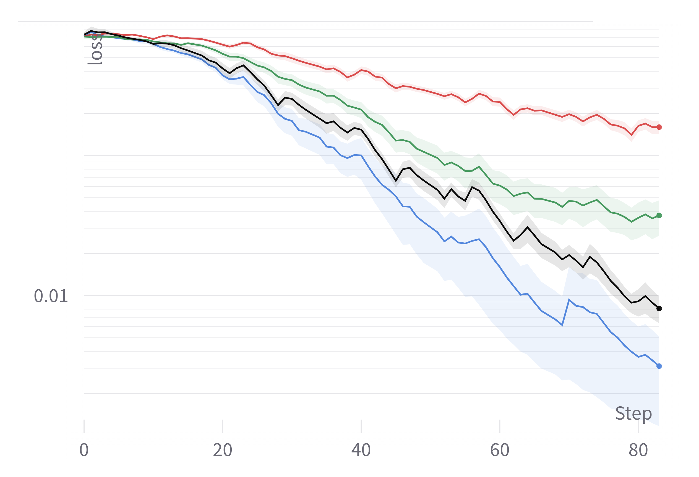

# Faster Convergence for Transformer Fine-tuning with Line Search Methods

The Repository to the Paper Faster Convergence for Transformer Fine-tuning with Line Search Methods

## Abstract

Recent works have shown that line search methods greatly increase performance of traditional stochastic gradient descent methods on a variety of datasets and architectures. In this work we succeed in extending line search methods to the novel and highly popular Transformer architecture and dataset domains in natural language processing. 
More specifically, we combine the Armijo line search with the Adam optimizer and extend it by subdividing the networks architecture into sensible units and perform the line search separately on these local units. 
Our optimization method outperforms the traditional Adam optimizer and achieves significant performance improvements for small data sets or small training budgets, while performing equal or better for other tested cases.
Our work is publicly available as a python package, which provides a hyperparameter-free pytorch optimizer that is compatible with arbitrary network architectures.



## install

Dependencies:

- [pytorch](https://pytorch.org) <3
- [numpy](https://numpy.org/install/) <3
- `pip install transformers` for huggingface transformers <3 
- `pip install datasets` for huggingface datasets <3 
- `pip install tensorflow-datasets` for tensorflow datasets <3 
- `pip install wandb` for optional logging <3
- for easy replication use conda and environment.yml


## Replicating Results
For replicating the main Results of the Paper run:

```
$ python run_multiple.py
```


For replicating specific runs or trying out different hyperparameters use:

```
$ python main.py 
```

and change the config.json file appropriately

## use in own projects

The custom optimizer is in \sls\adam_sls.py and \sls\sls_base.py 
Example Usage:

```
from sls.adam_sls import AdamSLS
optimizer = AdamSLS( [model.parameters()] )
```
The typical pytorch forward pass needs to be changed from :
``` 
optimizer.zero_grad()
y_pred = model(batch_x)
loss = criterion(y_pred, batch_y)    
loss.backward()
optimizer.step()
scheduler.step() 
```
to:
``` 
closure = lambda : criterion(model(batch_x), batch_y)
optimizer.zero_grad()
loss = optimizer.step(closure = closure)
```
see embedder.py in the fit() method for more details
